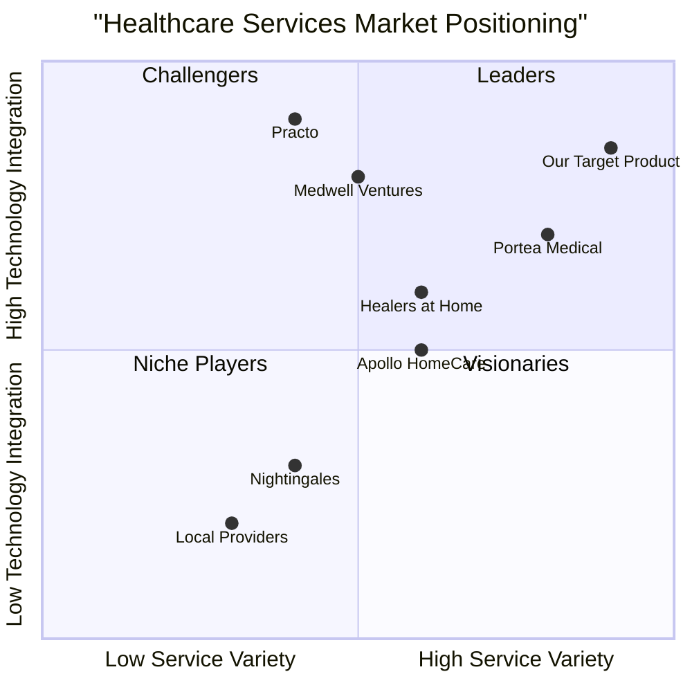

# Product Requirements Document (PRD)
## Lucknow Nursing Healthcare Services - MVP Specification

### 1. Language & Project Information

**Language:** English  
**Programming Language:** Spring Boot (Backend), Flutter (Frontend), PostgreSQL (Database)  
**Project Name:** lucknow_nursing_healthcare_services  
**MVP Scope:** Cross-platform healthcare services platform enabling customers to book nursing, elderly care, physiotherapy, child care, and ambulance services, and manage medical equipment rentals or purchases — starting with Lucknow as the pilot region.

### 2. MVP Objective & Scope

#### 2.1 MVP Objective
Build a **cross-platform healthcare services platform** enabling customers to **book nursing, elderly care, physiotherapy, child care, and ambulance services**, and manage **medical equipment rentals or purchases** — starting with Lucknow as the pilot region.

The MVP focuses on **core service booking**, **provider management**, and **secure transactions**.

#### 2.2 MVP Timeline (8 Weeks)

| Phase                                      | Duration | Deliverables                                         |
| ------------------------------------------ | -------- | ---------------------------------------------------- |
| **Phase 1: Core Setup**                    | Week 1–2 | DB schema, backend boilerplate, API skeleton         |
| **Phase 2: Authentication + Booking APIs** | Week 3–4 | User registration, booking CRUD, provider assignment |
| **Phase 3: Flutter App UI & Integration**  | Week 5–6 | Mobile app screens + API integration                 |
| **Phase 4: Admin Dashboard + QA**          | Week 7   | Dashboard build + testing                            |
| **Phase 5: Launch & Feedback Loop**        | Week 8   | Deploy on AWS / Play Store beta                      |

#### 2.3 Core MVP APIs

* `/api/auth/register`
* `/api/auth/login`
* `/api/users/profile`
* `/api/services/list`
* `/api/bookings/create`
* `/api/bookings/user/{id}`
* `/api/bookings/provider/{id}`
* `/api/payments/initiate` *(Phase 1.5)*

### 3. MVP Features

#### 3.1 Customer Features (Mobile App - Flutter)

| Feature                            | Description                                                                     |
| ---------------------------------- | ------------------------------------------------------------------------------- |
| **User Registration & Login**      | Email + password authentication (Firebase Auth or Spring Security JWT).         |
| **Profile Management**             | Name, contact, address, emergency contact.                                      |
| **Browse Services**                | Nursing, Elderly Care, Physiotherapy, Child Care, Medical Equipment, Ambulance. |
| **Book a Service**                 | Simple booking form: service type, date/time, duration, address.                |
| **Booking History**                | View upcoming and past bookings.                                                |
| **Payment Gateway (Phase 1.5)**    | Razorpay or Stripe integration for prepaid bookings.                            |
| **Ratings & Feedback (Phase 1.5)** | Rate service providers post-completion.                                         |

#### 3.2 Service Provider Features (Web Dashboard)

| Feature                    | Description                                               |
| -------------------------- | --------------------------------------------------------- |
| **Login & Profile Setup**  | Add specialization, experience, availability slots.       |
| **View Assigned Bookings** | See upcoming appointments, customer details, and contact. |
| **Update Booking Status**  | Mark as accepted, in-progress, or completed.              |
| **Earnings Overview**      | Simple summary of completed jobs and earnings.            |

#### 3.3 Admin Panel (Web - Spring Boot + React or Thymeleaf)

| Feature                         | Description                                     |
| ------------------------------- | ----------------------------------------------- |
| **Dashboard Overview**          | Total users, active services, pending bookings. |
| **User Management**             | Approve/disable customer or provider accounts.  |
| **Booking Management**          | View and assign bookings manually if needed.    |
| **Service Category Management** | Add/edit/delete services and pricing.           |
| **Reports (Basic)**             | Daily bookings, revenue overview.               |

### 4. Database – Core Tables (MVP)

| Table                  | Key Columns                                                |
| ---------------------- | ---------------------------------------------------------- |
| **users**              | user_id, name, email, password_hash, role, status          |
| **service_categories** | category_id, name, description                             |
| **services**           | service_id, category_id, name, price, duration             |
| **bookings**           | booking_id, user_id, service_id, provider_id, date, status |
| **providers**          | provider_id, name, qualification, rating, availability     |
| **payments**           | payment_id, booking_id, amount, status, method             |
| **reviews**            | review_id, booking_id, rating, comment                     |

### 5. User Stories

**Customer Stories:**
- As a family member of an elderly patient, I want to book qualified nursing services with verified credentials so that I can ensure professional care for my loved one
- As a working parent, I want to schedule child care services with flexible timing options so that I can manage my professional commitments without compromising child safety
- As a patient recovering from surgery, I want to rent medical equipment with home delivery so that I can continue treatment comfortably at home
- As a customer in medical emergency, I want to book ambulance services so that I can get immediate medical transportation
- As a service user, I want to rate and provide feedback on services so that I can help improve service quality and assist other customers

**Provider Stories:**
- As a healthcare provider, I want to view my assigned bookings so that I can plan my schedule
- As a provider, I want to update booking status so that customers know the progress
- As a provider, I want to see my earnings so that I can track my income

**Admin Stories:**
- As a healthcare service administrator, I want to manage user accounts so that I can ensure service quality
- As a business owner, I want to track basic analytics so that I can make data-driven decisions
- As an operations manager, I want to assign providers to bookings so that I can maximize service efficiency

### 6. Competitive Analysis

**1. Portea Medical**
- *Pros*: Established brand, comprehensive services, pan-India presence
- *Cons*: Limited local customization, higher pricing, complex booking process

**2. Nightingales Home Health Services**
- *Pros*: Specialized nursing care, experienced staff, good reputation
- *Cons*: Limited technology integration, restricted service portfolio, manual processes

**3. Medwell Ventures**
- *Pros*: Technology-focused, good mobile app, transparent pricing
- *Cons*: Limited geographical coverage, fewer service categories, newer brand

**4. Apollo HomeCare**
- *Pros*: Hospital backing, trusted brand, quality assurance
- *Cons*: Premium pricing, limited availability, hospital-centric approach

**5. Healers at Home**
- *Pros*: Affordable pricing, quick service, good customer support
- *Cons*: Limited advanced services, basic technology platform, quality inconsistency

**6. Local Healthcare Providers**
- *Pros*: Local knowledge, personal relationships, flexible pricing
- *Cons*: No digital platform, limited scalability, inconsistent quality

**7. Practo**
- *Pros*: Strong digital presence, doctor consultations, wide reach
- *Cons*: Limited home services, focus on consultations rather than care services

#### 2.4 Competitive Quadrant Chart



### 7. Technical Specifications

#### 7.1 MVP Technical Stack

| Layer                 | Tech Stack                            | Description                                              |
| --------------------- | ------------------------------------- | -------------------------------------------------------- |
| **Frontend (Mobile)** | Flutter                               | Unified app for Android & iOS.                           |
| **Backend**           | Spring Boot                           | RESTful API with modular architecture.                   |
| **Database**          | PostgreSQL                            | Central relational DB for services, users, and bookings. |
| **Auth**              | JWT (Spring Security) / Firebase Auth | Secure token-based access.                               |
| **Hosting**           | AWS / Render / Railway                | Containerized deployment (Docker).                       |
| **CI/CD (Phase 2)**   | GitHub Actions                        | Automated testing and deployment.                        |

#### 7.2 MVP Requirements

**P0 (Must-Have) Requirements:**
- User registration and authentication system
- Service booking and scheduling functionality
- Provider management and assignment system
- Basic payment processing (Phase 1.5)
- Booking management with status tracking
- Basic admin dashboard with core operations
- Mobile and web responsive design
- Database schema implementation
- Security implementation (JWT, HTTPS, data encryption)

**P1 (Phase 1.5) Requirements:**
- Payment gateway integration (Razorpay/Stripe)
- Rating and feedback system
- Email/SMS notifications
- Basic analytics dashboard

**P2 (Post-MVP) Requirements:**
- Advanced analytics and reporting
- Real-time tracking
- Multi-location support
- Advanced search and filtering
- Integration with external healthcare systems

### 8. UI Flow (Condensed)

**Customer App Flow:**

```
Launch App → Login/Register → Home → Select Service → 
View Details → Book Now → Confirm Booking → 
View Booking History → Logout
```

**Provider Dashboard Flow:**

```
Login → Dashboard → View Bookings → Update Status → 
View Earnings → Profile → Logout
```

**Admin Dashboard Flow:**

```
Login → Dashboard → Users → Bookings → Providers → Reports
```

### 9. Out-of-Scope for MVP (Future Releases)

* In-app chat between customers and providers
* Dynamic pricing engine
* Geo-tracking of ambulances
* Advanced analytics and AI-driven staff allocation
* Multi-city support (initially Lucknow only)

### 10. Expected MVP Outcome

Deliver a **fully functional prototype** allowing:

* Customers to book verified healthcare services
* Providers to accept and manage assignments
* Admins to manage users, providers, and bookings

This MVP will validate **market demand, operational workflows, and tech feasibility** for scaling to multiple cities.

### 11. Open Questions for MVP

1. **Service Area Coverage**: What is the exact geographical coverage area within Lucknow? Should we include nearby districts?

2. **Provider Verification Process**: What specific credentials and background checks are required for different types of healthcare providers?

3. **Emergency Service Response Time**: What is the target response time for emergency bookings, and how should priority be handled?

4. **Payment Terms**: What are the payment terms for different services? Should we support partial payments or installments for long-term care?

5. **Admin Dashboard Technology**: Should we use React or Thymeleaf for the admin dashboard?

6. **Regulatory Compliance**: What specific healthcare regulations and licensing requirements must be met in Uttar Pradesh?

7. **Data Retention Policy**: How long should patient data and service records be retained, and what are the privacy requirements?

---

*This MVP PRD document serves as the foundation for developing the Lucknow Nursing Healthcare Services platform. The focus is on core functionality that can be delivered in 8 weeks to validate market demand and operational workflows.*